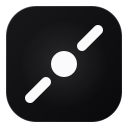

<p align="center">
  <a href="https://github.com/cc-hearts/tool-kit">
    
  </a>
</p>

<h1 align="center">Tool Kit · 开发者工具市场</h1>

<p align="center">
  集成常用开发工具的开源「工具市场」，覆盖数据转换、代码辅助、安全加密、图片处理等高频场景。
  <br />
  <strong>100% 浏览器本地运算 · 隐私优先 · 现代全栈 SSR</strong>
</p>

<p align="center">
  <a href="https://github.com/cc-hearts/tool-kit"></a>
  <a href="https://github.com/cc-hearts/tool-kit"></a>
  <a href="https://github.com/cc-hearts/tool-kit"></a>
  <a href="https://github.com/cc-hearts/tool-kit"></a>
  <a href="https://github.com/cc-hearts/tool-kit"></a>
  <a href="./LICENSE"></a>
  <a href="https://github.com/cc-hearts/tool-kit/pulls"></a>
</p>

<p align="center">
  <a href="./README.md">English</a> · <b>简体中文</b>
</p>


---

## 🌟 特性与技术栈

- **现代全栈框架**：基于 **Nuxt 4** + **Vue 3.5+** 构建，支持全站 SSR 服务端渲染与高性能客户端水合。
- **现代化组件库**：采用 **antdv-next** 与官方 **`@antdv-next/nuxt`** 模块，内置 SSR CSS-in-JS 服务端样式提取与组件自动注册。
- **原子化样式**：**UnoCSS**（preset-wind3）配合 Shadcn / Zinc 语义化设计令牌，提供一致且精致的视觉体验。
- **深色模式**：内置暗色与亮色主题切换，基于 Cookie 持久化状态，杜绝首屏闪烁与水合不匹配。
- **物料注册表驱动**：工具以插件化结构独立组织，基于动态 `import()` 按需加载，URL 查询参数（`?category=`、`?q=`）实时同步。
- **纯本地运行**：大部分工具均基于浏览器本地 API（如 Web Crypto API、Canvas 等）执行，数据不出浏览器，保障隐私与安全。

---

## 🛠️ 内置工具清单

目前已收录 **8 款常用实用工具**，涵盖 5 大分类：

| 工具名称 | 分类 | 说明 |
|---|---|---|
| **YAML To DTS** | 格式转换 | 将 YAML 配置内容转换为对应的 TypeScript 类型声明（`.d.ts`），支持嵌套对象与数组推导 |
| **SVG Format** | 格式转换 | 格式化 SVG 源码，将 `fill` / `stroke` 颜色统一替换为 `currentColor`，便于封装为通用图标组件 |
| **Secret Generator** | 安全加密 | 基于 Web Crypto API 本地生成 AES 密钥（CBC/GCM）、高强度随机密码、UUID v4 与 JWT Secret |
| **Word Case Convert** | 格式转换 | 批量将单词或短语转换为 camelCase、kebab-case、snake_case、PascalCase 等常见命名格式 |
| **Image Crop** | 图片处理 | 本地图片裁剪工具，支持原图不裁剪导出、缩放拖拽、旋转、圆形/矩形裁剪，支持导出为 PNG/JPEG/WebP |
| **Image Preview** | 图片处理 | 单图预览与多图画廊浏览：支持输入图片 URL、本地文件上传、拖拽或剪贴板粘贴直接查看 |
| **Random Avatar** | 趣味生成 | 生成 Notion 简笔画风格头像，支持五官、发型、配色的随机拼装或单独重掷，支持导出 SVG/PNG |
| **Funny Nickname** | 趣味生成 | 注册取名救星：批量生成沙雕中文网名与搞笑英文网名（吃货系、摆烂系、技术梗、头衔梗等） |

---

## 🚀 快速开始

### 环境要求

- Node.js >= 18.0.0
- pnpm >= 11.0.0

### 安装与运行

```bash
# 1. 克隆项目仓库
git clone https://github.com/cc-hearts/tool-kit.git
cd tool-kit

# 2. 安装依赖
pnpm install

# 3. 启动开发服务器（默认端口 3000）
pnpm dev

# 4. 构建生产产物
pnpm build

# 5. 预览生产构建
pnpm preview
```

> **依赖安装说明**：项目在 `pnpm-workspace.yaml` 中配置了供应链策略支持，并允许了构建依赖的执行脚本。

---

## 📂 目录结构

```text
tool-kit/
├── app/
│   ├── app.vue                    # 根组件：AConfigProvider（主题/中文国际化）+ AApp（反馈上下文）+ 布局出口
│   ├── error.vue                  # 全局错误缺省页（404 / 500）
│   ├── sections.ts                # ★ 栏目注册表（工具 / 提示词 / …），驱动顶部 tab 导航
│   ├── layouts/
│   │   └── default.vue            # 基础骨架：Header + 页面容器 + Footer
│   ├── pages/
│   │   ├── index.vue              # 工具栏目：分类侧边栏 + 工具栏 + 工具卡片网格
│   │   ├── prompts.vue            # 提示词栏目占位页（沿用同一套栏目外壳）
│   │   └── tools/
│   │       └── [slug].vue         # 工具详情动态路由：按 slug 动态加载对应工具组件
│   ├── components/                # 通用组件（Nuxt 自动导入，pathPrefix: false）
│   │   ├── AppHeader.vue          # 顶部导航栏：上行品牌 + 搜索 + 主题，下行栏目 tab
│   │   ├── SectionNav.vue         # 栏目 tab 导航（工具 / 提示词 / …），由 sections.ts 驱动
│   │   ├── AppFooter.vue          # 底部信息栏
│   │   ├── GridBackdrop.vue       # 方格纸底纹背景层（fixed，铺在所有内容之下）
│   │   ├── CategoryMenu.vue       # 分类侧边栏列表（带数量；移动端改用下拉选择）
│   │   ├── ToolCard.vue           # 市场首页工具卡片
│   │   ├── ToolGrid.vue           # 卡片网格布局 + 搜索空状态提示
│   │   └── ToolPageShell.vue      # 工具详情页公共外壳（返回按钮 + 标题区 + 内容插槽）
│   ├── tools/                     # ★ 工具注册表与具体工具实现
│   │   ├── types.ts               # ToolMeta 接口定义与 defineTool() 辅助函数
│   │   ├── categories.ts          # 分类元数据清单
│   │   ├── index.ts               # 工具总注册表与 getToolBySlug() 查询工具函数
│   │   └── <slug>/                # 单个工具独立目录（物料目录）
│   │       ├── index.ts           # defineTool({...}) 工具元信息配置
│   │       └── XxxTool.vue        # 工具视图组件（采用 dynamic import() 懒加载）
│   ├── composables/
│   │   └── useTheme.ts            # 主题状态管理（Cookie 持久化 + antdv-next Design Token）
│   ├── utils/                     # 通用工具函数（Nuxt 自动导入，如剪贴板复制）
│   └── assets/css/main.css        # 全局设计令牌与样式兼容规则
├── server/
│   └── api/track.post.ts          # 服务端路由示例（事件行为埋点）
├── nuxt.config.ts                 # Nuxt 核心配置文件（模块注入、SEO Meta 等）
├── uno.config.ts                  # UnoCSS 设计系统与快捷原子类配置
└── package.json                   # 项目依赖与运行脚本
```

---

## 🧩 如何新增一个工具？

项目的核心设计是**「物料清单模式」**，添加新工具只需完成简单的声明即可自动挂载到整个系统：

### 步骤 1：创建工具目录与视图

在 `app/tools/<slug>/` 目录下新建视图组件（如 `app/tools/my-tool/MyTool.vue`）：

```vue
<!-- app/tools/my-tool/MyTool.vue -->
<script setup lang="ts">
import { App } from 'antdv-next'

// App.useApp() 返回带 ConfigProvider 主题 / 语言上下文的反馈实例（静态 message 不继承主题）
const { message } = App.useApp()

const text = ref('')
function handleAction() {
  message.success('操作成功！')
}
</script>

<template>
  <div class="flex flex-col gap-4">
    <a-textarea v-model:value="text" :rows="8" placeholder="请输入内容..." />
    <div class="flex justify-end">
      <a-button type="primary" @click="handleAction">处理</a-button>
    </div>
  </div>
</template>
```

### 步骤 2：定义工具元信息

在 `app/tools/my-tool/index.ts` 中使用 `defineTool` 声明工具信息：

```ts
// app/tools/my-tool/index.ts
import { Wrench } from 'lucide-vue-next'
import { defineTool } from '../types'

export default defineTool({
  slug: 'my-tool',                            // 路由路径：/tools/my-tool（全局唯一）
  name: '我的实用工具',                         // 工具展示名称
  description: '一句话清晰描述该工具解决的问题。', // 工具简述
  category: 'devtools',                       // 所属分类，参考 categories.ts
  icon: Wrench,                               // Lucide 图标组件
  tags: ['utility', 'demo'],                  // 标签列表
  component: () => import('./MyTool.vue'),    // 动态懒加载组件，只有访问该详情页才下载代码
})
```

### 步骤 3：追加至总注册表

在 `app/tools/index.ts` 的 `tools` 数组中追加导入该工具：

```ts
// app/tools/index.ts
import myTool from './my-tool'

export const tools: ToolMeta[] = [
  // ... 已有工具
  myTool,
]
```

**大功告成！** 首页卡片渲染、分类筛选计数、全局关键词检索、详情页路由分配均会自动生效，无需修改任何页面或路由文件。如需扩展分类，只需在 `app/tools/categories.ts` 中增加配置即可。

---

## 🏗️ 架构与设计规范

- **注册表驱动架构（BOM Pattern）**：`app/tools` 充当物料库的唯一真理源（Single Source of Truth）。各工具在构建产物中自动独立分包，按需加载，避免首页首屏打包过大。
- **URL 状态同步**：分类筛选（`?category=`）与全局搜索（`?q=`）实时同步至浏览器 URL Query，支持前进/后退、页面刷新与直链分享。
- **SSR-Safe 样式体系**：
  - 基于 `@antdv-next/nuxt` 模块实现 CSS-in-JS 的服务端样式提取，避免首屏样式闪烁（FOUC）；
  - 主题偏好通过 Cookie 持久化（而非仅保存在 localStorage），确保服务端渲染与客户端水合的一致性；
  - 样式层通过 UnoCSS 与 `main.css` 对齐 Shadcn Zinc 色系令牌，暗色模式与亮色模式无缝切换。

---

## 📄 开源许可

本项目基于 [MIT 许可证](./LICENSE) 开源发布。
